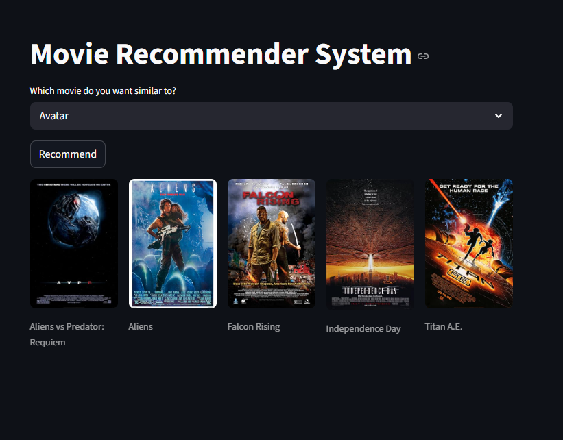

# 🎬 Movie Recommender System

A **content-based movie recommendation web application** built using **Python, Pandas, Scikit-Learn, NLTK, and Streamlit**.

The system recommends movies similar to a selected movie by analyzing textual metadata such as genres, cast, crew, keywords, and overview using **Natural Language Processing (NLP)** and **Cosine Similarity**.

Movie posters are fetched dynamically using the **OMDb API** for a richer user experience.

---

## Demo



---

## Features

- Recommend the **top 5 similar movies**
- Interactive **Streamlit** web interface
- Movie posters displayed using the **OMDb API**
- Content-based recommendation engine
- Fast recommendations using a precomputed similarity matrix

---

## Tech Stack

- Python
- Pandas
- NumPy
- Scikit-Learn
- NLTK
- Streamlit
- Requests
- OMDb API

---

## Recommendation Pipeline

The recommendation engine follows these steps:

1. Merge the movie and credits datasets
2. Clean and preprocess the data
3. Extract important features:
   - Genres
   - Keywords
   - Cast
   - Crew
   - Overview
4. Apply text preprocessing and stemming using NLTK
5. Convert text into numerical vectors using **CountVectorizer**
6. Compute similarity using **Cosine Similarity**
7. Recommend the five most similar movies

---

## Dataset

This project uses the **TMDB 5000 Movies Dataset**.

Download it from:

https://www.kaggle.com/datasets/tmdb/tmdb-movie-metadata

Required files:

- `tmdb_5000_movies.csv`
- `tmdb_5000_credits.csv`

---

## Project Structure

```text
Movie-Recommender/
│
├── code.py
├── movie_recommender.ipynb
├── movies_dict.pkl
├── similarity.pkl
├── requirements.txt
├── README.md
├── demo.png
│
└── content/
    ├── tmdb_5000_movies.csv
    └── tmdb_5000_credits.csv
```

---

## Installation

Clone the repository:

```bash
git clone https://github.com/<your-username>/<repository-name>.git
```

Move into the project directory:

```bash
cd Movie-Recommender
```

(Optional) Create a virtual environment:

```bash
python -m venv venv
```

Activate it (Windows):

```bash
venv\Scripts\activate
```

Install the required packages:

```bash
pip install -r requirements.txt
```

---

## OMDb API Setup

This project uses the **OMDb API** to fetch movie posters.

1. Get a free API key:

https://www.omdbapi.com/apikey.aspx

2. Add your API key inside `code.py`:

```python
API_KEY = "YOUR_API_KEY"
```

---

## Run the Application

```bash
streamlit run code.py
```

The application will start at:

```
http://localhost:8501
```

---

## Regenerating the Recommendation Model

To recreate the recommendation model:

1. Download the TMDB dataset.
2. Place both CSV files inside the `content/` folder.
3. Open `movie_recommender.ipynb`.
4. Run all notebook cells.
5. New pickle files will be generated:

```text
movies_dict.pkl
similarity.pkl
```

## Future Improvements

- Hybrid recommendation system
- User ratings and personalized recommendations
- Genre-based filtering
- Better poster caching
- Deploy on Streamlit Community Cloud

---

## License

This project is intended for educational and portfolio purposes.